# Conversion from ESRI Multipatch to FBX

## 1. Overview

In this tutorial, we will show the necessary step to convert from Esri Multipatch to a 3D Model that can be used in Unity 3D.

## 2. Prerequisites

Multiple softwares are required for this conversion:

- ArcGIS 10.5: ArcMap and ArcScene are used.
- Blender 2.78
- CityEngine (TODO)

## 3. Retrieving the Model and Building footprints

A complete 3D model of all buildings in New York City are available at Department of Information Technologies and Telecommunication(DoITT)'s [offical website](http://www1.nyc.gov/site/doitt/initiatives/3d-building.page). In this tutorial we are going to use "Multipatch (ESRI)" format. Download the `.zip` file here: http://maps.nyc.gov/download/3dmodel/DA_WISE_Multipatch.zip. Unzip the file to the desired location.

This model consists of multiple parts divided in to "delivery areas". For the area that contains Columbia University campus, we use delivery area number `13`, which contains the Manhattan Island.

We will also need the building footprints from NYC OpenData's [official website](https://data.cityofnewyork.us/Housing-Development/Building-Footprints/nqwf-w8eh). Once the web page is loaded, click the "Export" button on the top right corner of the Map. Select "Shapefile" as the format. A `.zip` file will be automatically downloaded. Unzip the file to the desired location.

## 4. Conversion to VRML using ArcGIS

To properly import our Multipatch data, we will be using two softwares from Esri's ArcGIS software[1]: ArcMap and ArcScene. We will use ArcMap to import the original data, select the area of interest, and export in Shapefile format. We then use ArcScene to open the newly created Shapefile, and export the model to Virtual Reality Modeling Language(VRML) format[2], which is readable my many modeling softwares.

### Importing Multipatch data to ArcMap

1. Start up ArcMap, in the `File` menu on the toolbar, click `Add data`
2. In the file navigator, locate the upzipped DoITT model. Select `DA_WISE_Multipatch/DA13_3D_Buildings_Multipatch.gdb/Buildings_3D/Buildings_Multipatch` and click `Add`.
3. Once imported successfully, you should be able to see a flattened version of the Manhattan Island.
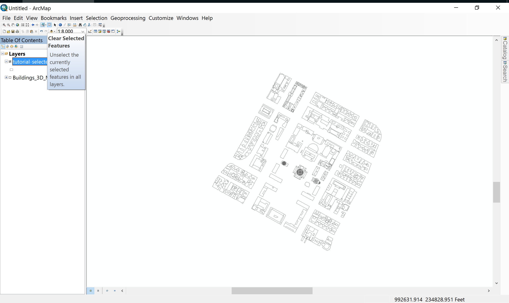
4. Now we select the Area of Interest, campus of Columbia University by using the selection tools.
  - On the toolbar, click `Interactive Selection method` and choose `Select by Polygon`
  - On the view port, zoom into the area of interest, and click through the four corners of the rectangular area of the campus.
  - Now the selected area should appear to be blue
  - Right click on the `Layers` icon in the `Table of Contents` pane, and click `Data -> Export data`
  - We will export the selected area to Shapefile format, select your desired location and click `OK`.
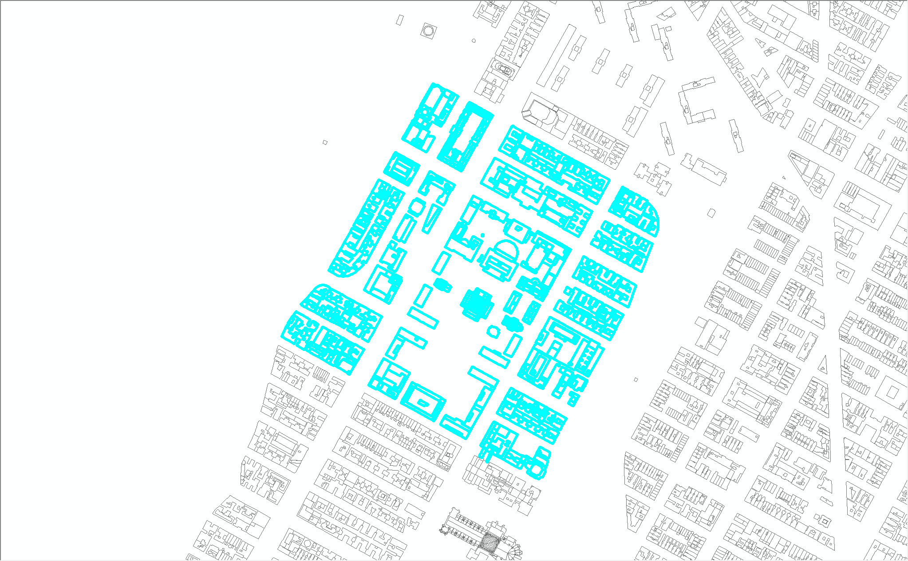

### Exporting Shapefile data to VRML format

1. Start up ArcMap, in the `File` menu on the toolbar, click `Add data`
2. In the file navigator, select the `.shp` file you created from last section and click `Add`.
3. Once imported successfully, you will see the 3D model of the Columbia campus
    - 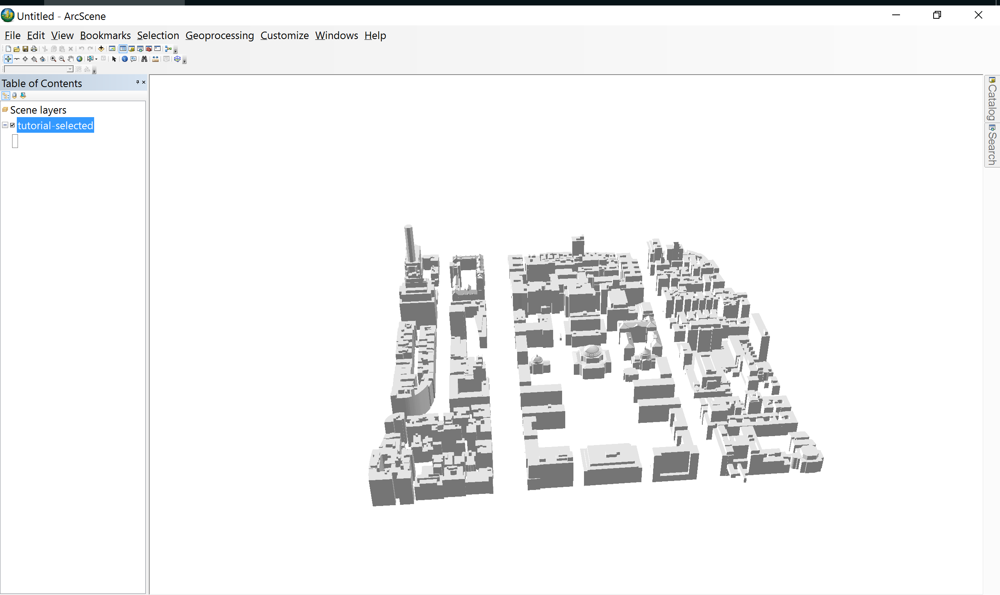
4. Now go to `File -> Export scene -> 3D`, make sure you see the following configuration when you click `Options`, and select the output location
    - 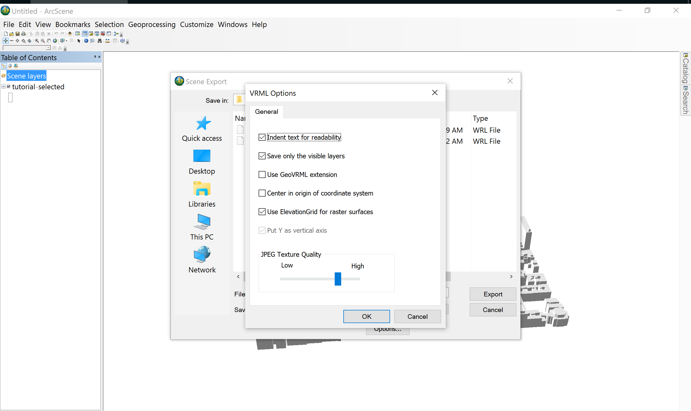
5. Now ArcScene should have already generated a `.wrl` file at the selected location

## 5. Conversion to FBX using Blender

Since VRML format is not directly supported by Unity, we have to further convert the product from the last step to FBX format. There are many possible choices of modeling softwares. In this tutorial, we will use Blender.

A prerequisite for this section is one extra plugin for importing X3D/VRML2 files. The following steps are based on this [youtube video](https://www.youtube.com/watch?v=ZXgLdyCLumI):
1. Go to `File -> User preferences -> Add-ons`
2. Type `vrml` in the search bar on the right-hand side of the window.
3. There should be an option called "Import-Eport: Web3D X3D/VRML2 format. Make sure this option is checked.
  - 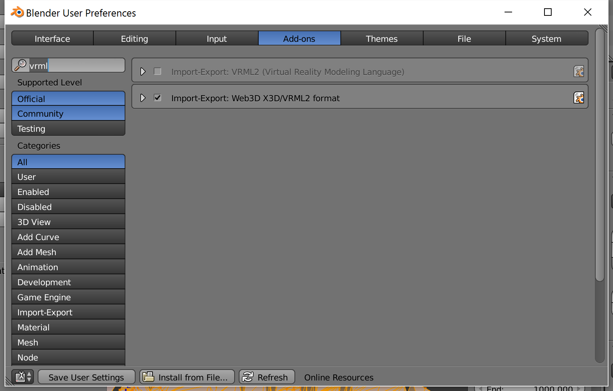

After that, we can proceed with the importation:

1. Open blender. It will automatically create an empty scene with a cube at the origin.
2. Remove the cube in the center, the camera, the light, and the lamp. By right-clicking on these items and click `delete`.
3. On the toolbar at the top of the window, click `File -> import -> X3D Extensible 3D (.x3d/.wrl)`
4. In the file explorer, find the `.wrl` file you exported from the last section. Make sure you have the same options selected on the left pane.
    - 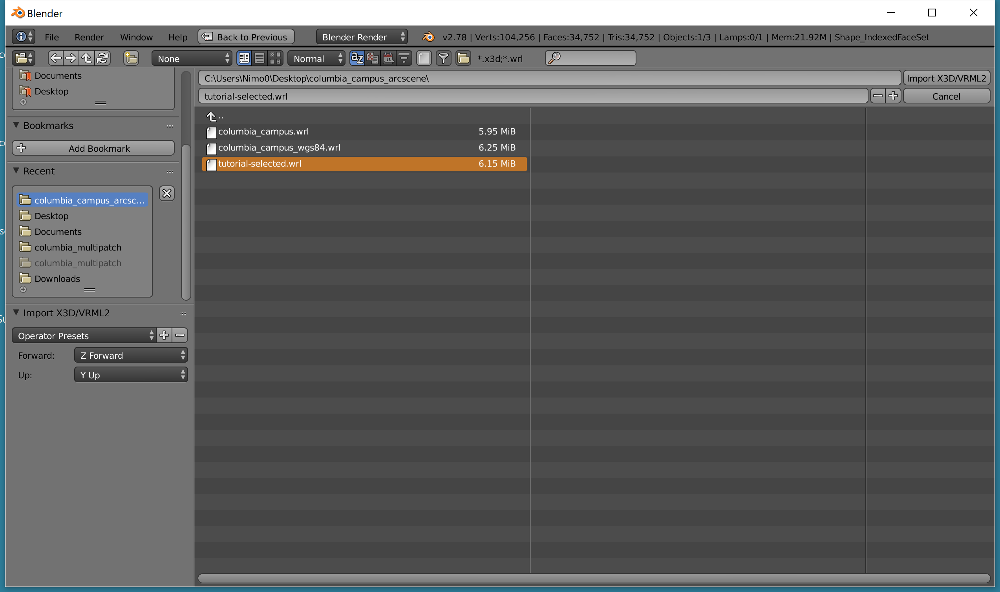
5. When you return to the view port, you might not see the model right away, because the original model uses a coordinate system with relatively large values in both longitude and latitude. Move the focus onto the imported mesh by;
  - (1) clicking on `Shape_IndexedFaceSet` on the scene explorer on the right side of the window.
  - (2) on the toolbar at the bottom of the window, click `View -> View Selected`.
  - 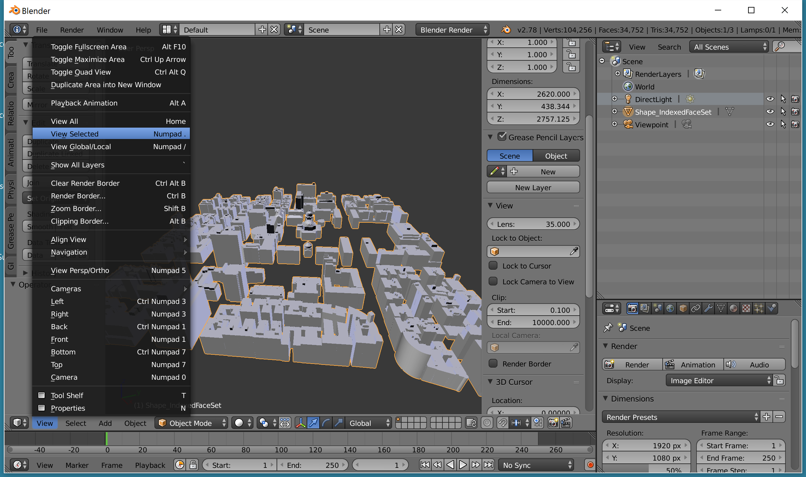
6. If you still don't see the model, zoom out a little by scrolling down. The default camera is set to 1000 units for the far plane, which is a little to small for our big model. To change this, go to `View -> Properties`. A new pane will be added to the window. In the properties pane, under `View -> Clip`, change `far` to something like `10000` will do it.
  - 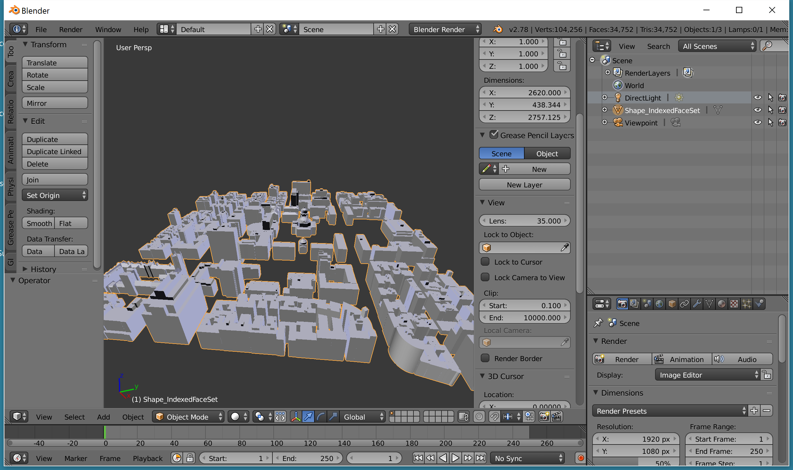
7. If everything is done properly, you should see the following:
  - 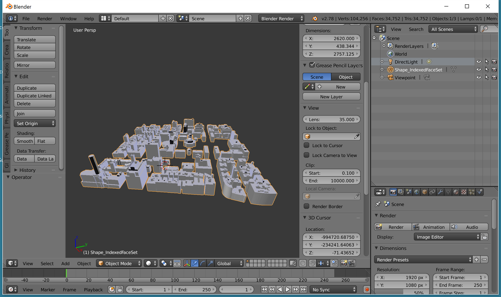

8. We need to set the origin to a point in the original coordinate system, instead of the default one. Go to the pane on the left, under `Tools` tab, there is a drop-down button called `Set Origin`. Choose `Origin to Geometry`.
  - 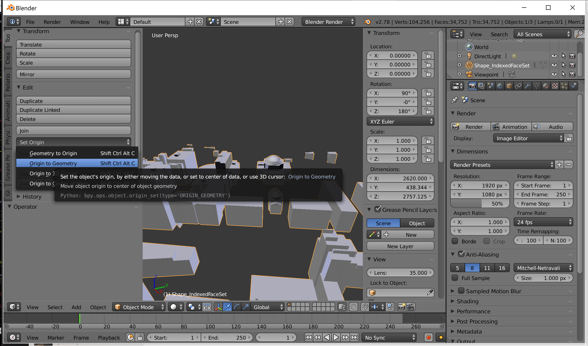

9. Next, we are going to fix up the geometries in the model. First, enter the Edit mode by either hitting `Tab`, or going to the toolbar below and select `Edit Mode`.
  - 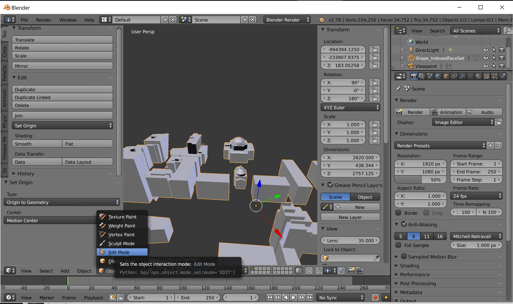
10. On the left hand side, go to `Tools` tab and find `Remove` section. Under this section, click the `Remove Doubles` button.
  - 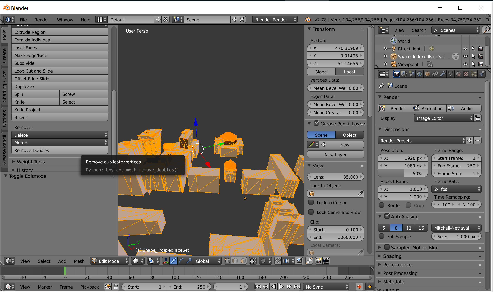
11. Now that duplicated vertices are removed, we need to recalculate the normals so that they are all facing out. In the same pane, go to the `Shading/UVs` tab, find `Normals` section.
12. Click the `Recalculate` button.
  - 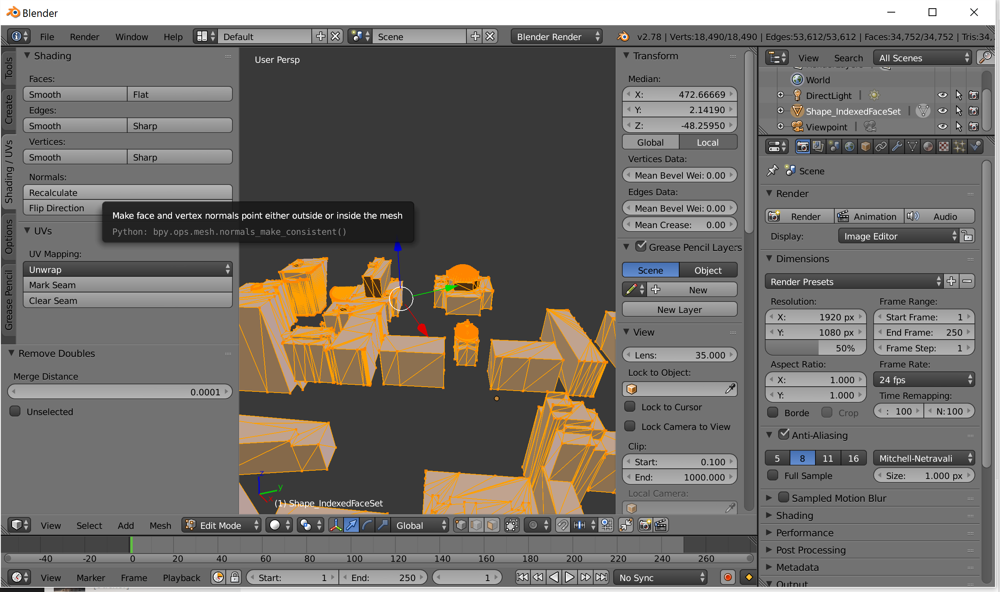
13. Now the model should be ready. Let's export it to FBX format. On the toolbar on the top, go to `File -> export -> FBX`. Choose a desired position for the output file, and hit Export.
  - 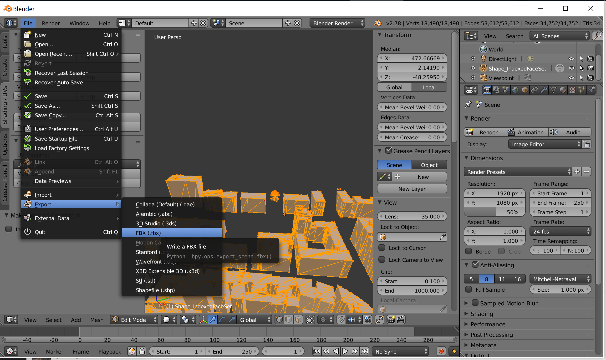

## 6. importing the model into Unity

This section is fairly straight-forward. Just drag the `.fbx` file into Unity's file navigator. To enable collidor, check `generate collidor` in the menu for the `.fbx` file.

One issue with the current coordinate system is that, the numbers are too large, and it seems to be causing problems for intersection calculations. To avoid this:

1. Remember the original center coordinates.
2. Find the coordinates of the target site on [epsg.io](epsg.io).
3. Move the model to `(0, 0, 0)`.
4. Subtract the original center by the target coordinates. This will give you offsets in x, y and z axis. Use that for the camera position.

## References

- [1] ArcGIS Desktop official website, http://desktop.arcgis.com/en/.
- [2] VRML Wikipedia page, https://en.wikipedia.org/wiki/VRML.
